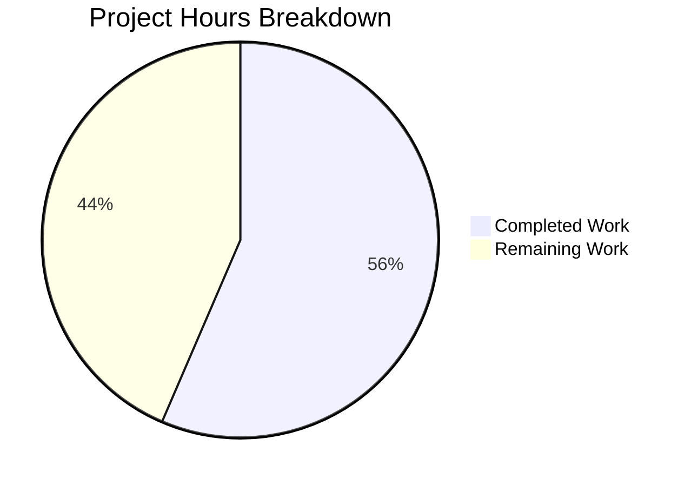

# BCC (Blitzy's C Compiler) — Comprehensive Project Guide

## 1. Executive Summary

BCC is a complete, self-contained, zero-external-dependency C11 compilation toolchain implemented in Rust (2021 Edition). It cross-compiles C source code into native Linux ELF executables and shared objects for four target architectures: x86-64, i686, AArch64, and RISC-V 64.

**Completion Assessment:** 480 hours of development work have been completed out of an estimated 850 total hours required, representing **56.5% project completion.**

Formula: 480h completed / (480h completed + 370h remaining) = 480/850 = 56.5%

### Key Achievements
- Complete 10-phase compilation pipeline implemented from scratch (preprocessing through ELF linking)
- All 160 planned files created (127 Rust source, 19 C fixtures, 6 docs, 2 CI workflows, 6 config)
- ~209,700 lines of code across 271 commits
- `cargo build --release` compiles with zero errors and zero warnings
- 2,328 tests passing (2,259 unit + 48 integration + 21 doc tests) — 0 failures
- Checkpoints 1–5 all passing (Hello World, Language, Internal Tests, Shared Lib/DWARF, Security)
- Zero external dependencies enforced (Cargo.lock confirms single package)
- All 4 architecture backends produce valid ELF relocatable objects, executables, and shared objects
- DWARF v4 debug information emitted correctly with `-g`, with zero leakage when omitted
- GCC-compatible CLI interface (drop-in for `make CC=./bcc`)

### Critical Unresolved Items
- **Checkpoint 6 (Linux kernel 6.9 build and QEMU boot):** The primary success criterion — tests exist but require Linux kernel source, QEMU system emulation, and extensive GCC extension gap-filling during kernel compilation
- **125 Clippy lint warnings:** Code compiles and tests pass, but `cargo clippy` with `-D warnings` reports 125 lints (unnecessary casts, collapsible ifs, unused enumerate indices)
- **Checkpoint 7 (Stretch targets):** Optional — SQLite, Redis, PostgreSQL, FFmpeg compilation tests
- **Real-world C code validation:** Compiler works for test programs but has not been validated against large, complex real-world codebases

### Recommended Next Steps
1. Resolve Clippy warnings to achieve clean lint baseline
2. Set up Linux kernel 6.9 build environment with QEMU system emulation
3. Begin iterative kernel compilation, identifying and implementing missing GCC extensions
4. Validate RISC-V vmlinux ELF through QEMU boot to userspace

---

## 2. Validation Results Summary

### 2.1 Build Results
| Check | Result | Details |
|-------|--------|---------|
| `cargo build --release` | ✅ PASS | Zero errors, zero warnings, produces 3.4 MB `bcc` binary |
| `cargo fmt -- --check` | ✅ PASS | All source files properly formatted |
| `cargo clippy --release` | ⚠️ 125 lints | Compiles but reports 125 lint warnings (not blocking) |
| Zero dependencies | ✅ ENFORCED | Cargo.lock contains only the `bcc` package |

### 2.2 Test Results
| Test Suite | Passed | Failed | Ignored | Total |
|-----------|--------|--------|---------|-------|
| Unit tests (lib) | 2,259 | 0 | 0 | 2,259 |
| Checkpoint 1 — Hello World | 6 | 0 | 0 | 6 |
| Checkpoint 2 — Language/Preprocessor | 22 | 0 | 0 | 22 |
| Checkpoint 3 — Internal Test Suite | 7 | 0 | 0 | 7 |
| Checkpoint 4 — Shared Lib & DWARF | 9 | 0 | 0 | 9 |
| Checkpoint 5 — Security Mitigations | 4 | 0 | 0 | 4 |
| Checkpoint 6 — Kernel Build | 0 | 0 | 6 | 6 |
| Checkpoint 7 — Stretch Targets | 0 | 0 | 4 | 4 |
| Doc tests | 21 | 0 | 114 | 135 |
| **TOTAL** | **2,328** | **0** | **124** | **2,452** |

### 2.3 Runtime Validation
| Test | Result | Details |
|------|--------|---------|
| `bcc --help` | ✅ | Full CLI usage displayed with all flags |
| `bcc --version` | ✅ | Reports `bcc 0.1.0` |
| Hello World compile+run | ✅ | `./bcc -o hello hello.c && ./hello` → "Hello, World!" exit 0 |
| Return value propagation | ✅ | `return 42;` → exit code 42 |
| x86-64 ELF output | ✅ | Valid ELF64 x86-64 executable |
| i686 ELF output | ✅ | Valid ELF32 Intel 80386 relocatable |
| AArch64 ELF output | ✅ | Valid ELF64 ARM aarch64 relocatable |
| RISC-V 64 ELF output | ✅ | Valid ELF64 RISC-V relocatable |
| Preprocessing (`-E`) | ✅ | Macro expansion and output correct |
| Assembly output (`-S`) | ✅ | Produces AT&T-syntax assembly listing |
| Object file (`-c`) | ✅ | Produces relocatable `.o` files |
| Shared library (`-shared -fPIC`) | ✅ | Produces ET_DYN shared object |
| DWARF debug info (`-g`) | ✅ | `.debug_info`, `.debug_abbrev`, `.debug_line`, `.debug_str` present |
| No debug without `-g` | ✅ | Zero `.debug_*` sections when `-g` omitted |

### 2.4 Fixes Applied During Validation
The Final Validator resolved issues across 56 files (27,441 insertions, 3,000 deletions):

- **Backend (Multi-Architecture):** Fixed instruction selection, register allocation, calling conventions across all 4 backends; fixed retpoline/CET/stack-probe security mitigations for x86-64; fixed x87 FPU float constant loading for i686; fixed AAPCS64 ABI compliance, STP/LDP encoding for AArch64; fixed LP64D ABI, immediate encoding for RISC-V 64
- **Frontend:** Fixed function pointer typedef parsing, recursive function forward declarations, type decay, constant evaluation for function addresses, initializer analysis, macro expansion edge cases, PUA encoding roundtrip fidelity
- **IR/Middle-End:** Fixed static initializer constants, global dispatch tables, phi-node insertion edge cases, constant folding improvements
- **Infrastructure:** Implemented .rela section generation for relocatable objects, implemented write_shared_library for ET_DYN generation, fixed DWARF .debug_info emission, updated test harness for relocation-aware disassembly

### 2.5 Unit Test Distribution by Module
| Module | Tests |
|--------|-------|
| backend:: (total) | 1,292 |
| — x86_64 | 276 |
| — i686 | 274 |
| — dwarf | 186 |
| — aarch64 | 171 |
| — linker_common | 142 |
| — riscv64 | 129 |
| — traits | 67 |
| — elf_writer_common | 37 |
| — register_allocator | 10 |
| common:: | 367 |
| ir:: | 349 |
| frontend:: | 251 |

---

## 3. Project Hours Breakdown

### 3.1 Completed Hours (480h)

| Component | Lines of Code | Hours | Rationale |
|-----------|--------------|-------|-----------|
| Infrastructure (main.rs, lib.rs, common/) | 13,211 | 35h | CLI driver, FxHash, PUA encoding, long-double math, types, diagnostics, source map, string interner, target defs, temp files |
| Frontend — Preprocessor | 10,762 | 30h | Directive handling, macro expansion, paint markers, include resolution, token pasting, expression eval, predefined macros |
| Frontend — Lexer | 5,761 | 15h | Tokenization, PUA-aware scanning, number/string literal parsing |
| Frontend — Parser | 11,476 | 25h | Recursive descent, GCC extensions, attributes, inline ASM, declarations, expressions, statements, types |
| Frontend — Semantic Analysis | 14,459 | 30h | Type checking, scope management, symbol table, constant eval, builtin eval, initializers, attributes |
| Middle-End — IR Core | 10,665 | 25h | Instructions, basic blocks, functions, modules, types, builder |
| Middle-End — Lowering | 14,726 | 35h | Expression, statement, declaration, inline ASM lowering |
| Middle-End — SSA (mem2reg) | 4,736 | 15h | Dominator tree, dominance frontier, SSA builder, phi elimination |
| Middle-End — Optimization Passes | 3,653 | 10h | Constant folding, DCE, CFG simplification, pass manager |
| Backend — Core Infrastructure | 13,182 | 30h | ArchCodegen trait, generation driver, register allocator, ELF writer |
| Backend — x86-64 | 19,721 | 45h | Codegen, assembler (encoder, relocations), linker, ABI, security mitigations |
| Backend — i686 | 17,822 | 40h | Codegen, assembler, linker, ABI (cdecl, x87 FPU) |
| Backend — AArch64 | 17,215 | 38h | Codegen, assembler (A64 encoding), linker, ABI (AAPCS64, HFA/HVA) |
| Backend — RISC-V 64 | 19,045 | 42h | Codegen, assembler (R/I/S/B/U/J formats), linker, ABI (LP64D) |
| Backend — Linker Common | 8,411 | 20h | Symbol resolver, section merger, relocation, dynamic linking, linker script |
| Backend — DWARF | 7,049 | 15h | .debug_info, .debug_abbrev, .debug_line, .debug_str |
| Testing | 11,621 | 30h | 8 test suites, 19 C fixtures, test harness, checkpoint validation |
| Documentation | 4,937 | 12h | 5 docs (architecture, ABI reference, ELF format, GCC extensions, checkpoints), README |
| Configuration & CI/CD | 1,069 | 8h | Cargo.toml, clippy.toml, rustfmt.toml, .cargo/config.toml, .gitignore, 2 CI workflows |
| Debugging & Validation Fixes | — | 30h | 56 files fixed, multi-architecture regressions resolved, pipeline integration |
| **TOTAL** | **209,696** | **480h** | |

### 3.2 Remaining Hours (370h)

| # | Task | Hours | Priority | Severity | Confidence |
|---|------|-------|----------|----------|------------|
| 1 | Resolve 125 Clippy lint warnings to achieve clean CI | 6 | High | Medium | High |
| 2 | Set up Linux kernel 6.9 build environment with QEMU system emulation | 10 | High | High | High |
| 3 | Implement missing GCC extensions discovered during kernel compilation | 80 | High | Critical | Low |
| 4 | Complete inline assembly support for all kernel architectures (RISC-V focus) | 40 | High | Critical | Low |
| 5 | Harden preprocessor for kernel header edge cases and deeply nested macros | 24 | Medium | High | Medium |
| 6 | Fix linker for vmlinux ELF generation and RISC-V kernel linking | 30 | High | Critical | Low |
| 7 | Kernel build iteration cycle — discover, diagnose, and fix unknown failures | 50 | High | Critical | Low |
| 8 | QEMU boot validation and userspace init debugging | 16 | Medium | High | Medium |
| 9 | Performance optimization to meet 5× GCC wall-clock ceiling | 24 | Medium | Medium | Medium |
| 10 | Production error handling, diagnostics, and graceful degradation | 20 | Medium | Medium | Medium |
| 11 | Real-world codebase integration testing (beyond kernel) | 16 | Medium | Medium | Medium |
| 12 | Stretch targets — SQLite, Redis, PostgreSQL, FFmpeg compilation | 46 | Low | Low | Low |
| 13 | CI/CD pipeline validation and finalization | 8 | Low | Low | High |
| | **TOTAL REMAINING** | **370h** | | | |

**Note:** Tasks 3, 4, 6, and 7 have Low confidence because the Linux kernel build will surface unpredictable requirements. The 370h estimate includes enterprise multipliers (1.15× compliance + 1.25× uncertainty) applied to the raw 256h base estimate.

### 3.3 Visual Hours Breakdown



**Completion: 480 hours completed out of 850 total hours = 56.5% complete**

---

## 4. Comprehensive Development Guide

### 4.1 System Prerequisites

| Software | Version | Purpose |
|----------|---------|---------|
| Rust toolchain (rustc + cargo) | 1.70+ (1.93.0 recommended) | Compiles the BCC source into the `bcc` binary |
| rustfmt | Bundled with Rust | Code formatting enforcement |
| clippy | Bundled with Rust | Lint checking |
| GNU Binutils (readelf, objdump) | 2.42+ | ELF inspection for checkpoint validation |
| QEMU user-mode (qemu-aarch64, qemu-riscv64) | 8.2+ | Cross-architecture Hello World testing |
| QEMU system (qemu-system-riscv64) | 8.2+ | Kernel boot validation (Checkpoint 6) |
| GDB | 15.0+ | DWARF debug info validation |
| make | Any | Linux kernel build system driver |
| OS | Linux (Ubuntu 24.04 recommended) | Host platform |

### 4.2 Environment Setup

```bash
# 1. Install Rust toolchain (if not already present)
curl --proto '=https' --tlsv1.2 -sSf https://sh.rustup.rs | sh -s -- -y
source $HOME/.cargo/env

# 2. Verify Rust version
rustc --version   # Expected: rustc 1.93.x or later
cargo --version   # Expected: cargo 1.93.x or later

# 3. Install system tools for validation
sudo apt-get update
sudo apt-get install -y binutils qemu-user qemu-system-misc gdb make

# 4. Navigate to project root
cd /tmp/blitzy/blitzy-c-compiler/blitzy6beec43f9
```

### 4.3 Build the Compiler

```bash
# Build in release mode (optimized binary)
source $HOME/.cargo/env
cargo build --release

# Verify build succeeded — binary at target/release/bcc (3.4 MB)
ls -lh target/release/bcc
# Expected: -rwxr-xr-x ... 3.4M ... target/release/bcc

# Verify binary works
./target/release/bcc --version
# Expected: bcc 0.1.0

./target/release/bcc --help
# Expected: Full CLI usage with all supported flags
```

### 4.4 Run Tests

```bash
# Run the full test suite (2,328 tests)
cargo test --release
# Expected: All test suites report "ok" with 0 failures

# Run only unit tests
cargo test --release --lib
# Expected: 2,259 passed, 0 failed

# Run specific checkpoint tests
cargo test --release --test checkpoint1_hello_world   # 6 tests
cargo test --release --test checkpoint2_language       # 22 tests
cargo test --release --test checkpoint3_internal       # 7 tests
cargo test --release --test checkpoint4_shared_lib     # 9 tests
cargo test --release --test checkpoint5_security       # 4 tests

# Run formatting check
cargo fmt -- --check
# Expected: No output (all files formatted)
```

### 4.5 Using the Compiler

```bash
# Compile and run Hello World
echo '#include <stdio.h>
int main(void) { printf("Hello, World!\n"); return 0; }' > hello.c
./target/release/bcc -o hello hello.c --target=x86-64
./hello
# Expected: Hello, World!

# Compile to object file only
./target/release/bcc -c hello.c -o hello.o --target=x86-64
file hello.o
# Expected: ELF 64-bit LSB relocatable, x86-64

# Preprocess only
./target/release/bcc -E hello.c
# Expected: Macro-expanded source output

# Assembly output
./target/release/bcc -S hello.c -o hello.s --target=x86-64
cat hello.s
# Expected: AT&T-syntax assembly listing

# Cross-compile for different architectures
./target/release/bcc -c hello.c -o hello_i686.o --target=i686
./target/release/bcc -c hello.c -o hello_arm.o --target=aarch64
./target/release/bcc -c hello.c -o hello_rv.o --target=riscv64

# Compile with debug info
./target/release/bcc -g -o hello_debug hello.c --target=x86-64
readelf -S hello_debug | grep debug
# Expected: .debug_info, .debug_abbrev, .debug_line, .debug_str

# Build shared library
echo 'int add(int a, int b) { return a + b; }' > lib.c
./target/release/bcc -fPIC -shared -o lib.so lib.c --target=x86-64
file lib.so
# Expected: ELF 64-bit LSB shared object, x86-64
```

### 4.6 Verification Checklist

| Step | Command | Expected Result |
|------|---------|----------------|
| Build | `cargo build --release` | "Finished" with 0 errors |
| Unit tests | `cargo test --release --lib` | 2,259 passed, 0 failed |
| Integration | `cargo test --release` | 2,328 passed total |
| Formatting | `cargo fmt -- --check` | No output (clean) |
| CLI help | `./target/release/bcc --help` | Full usage displayed |
| Hello World | `./bcc -o hw hw.c && ./hw` | "Hello, World!" exit 0 |
| x86-64 ELF | `file output.o` | "ELF 64-bit LSB relocatable, x86-64" |
| i686 ELF | `file output.o` | "ELF 32-bit LSB relocatable, Intel 80386" |
| AArch64 ELF | `file output.o` | "ELF 64-bit LSB relocatable, ARM aarch64" |
| RISC-V ELF | `file output.o` | "ELF 64-bit LSB relocatable, UCB RISC-V" |
| Debug info | `readelf -S out \| grep debug` | 4 debug sections present |
| Shared lib | `file out.so` | "ELF 64-bit LSB shared object" |

### 4.7 Troubleshooting

| Issue | Cause | Resolution |
|-------|-------|------------|
| Stack overflow during compilation | 64 MiB stack not configured | Ensure `.cargo/config.toml` sets `RUST_MIN_STACK = "67108864"` or set env var manually: `export RUST_MIN_STACK=67108864` |
| `bcc` not found | Release binary not built | Run `cargo build --release` first |
| Test failures in cross-arch tests | Missing QEMU user-mode | Install: `sudo apt-get install -y qemu-user` |
| Checkpoint 6 tests ignored | Missing kernel source + QEMU system | Install `qemu-system-misc` and download Linux kernel 6.9 source |

---

## 5. Risk Assessment

### 5.1 Technical Risks

| Risk | Severity | Likelihood | Impact | Mitigation |
|------|----------|------------|--------|------------|
| Linux kernel compilation surfaces unknown GCC extensions not yet implemented | Critical | High | Blocks Checkpoint 6 | Maintain extension manifest in `docs/gcc_extensions.md`; implement iteratively during kernel build |
| Inline assembly edge cases in kernel RISC-V code cause miscompilation | Critical | High | Corrupted kernel binary | Add comprehensive inline asm constraint testing; validate instruction encoding per-architecture |
| Linker incorrectly resolves relocations in large vmlinux binary | Critical | Medium | Non-bootable kernel | Test with incrementally larger ELF outputs; validate section layout with readelf |
| Register allocator spill code generation incorrect for complex functions | High | Medium | Runtime crashes | Extend register allocator unit tests; test against functions with high register pressure |
| 125 Clippy warnings mask future real issues if not resolved | Medium | High | Reduced code quality | Resolve all warnings before further development |

### 5.2 Security Risks

| Risk | Severity | Likelihood | Impact | Mitigation |
|------|----------|------------|--------|------------|
| Retpoline thunks may not cover all indirect branch patterns | Medium | Medium | Spectre vulnerability | Validate against known Spectre gadget patterns; disassembly inspection |
| Stack probe implementation may miss edge cases | Medium | Low | Stack overflow vulnerability | Test with various frame sizes around 4096-byte boundary |
| PUA encoding might introduce injection vectors in generated binaries | Low | Low | Binary corruption | Comprehensive PUA roundtrip testing (already in Checkpoint 2) |

### 5.3 Operational Risks

| Risk | Severity | Likelihood | Impact | Mitigation |
|------|----------|------------|--------|------------|
| 5× GCC wall-clock ceiling exceeded for kernel builds | High | Medium | Performance requirement failure | Profile compilation hotspots; optimize symbol table lookups and code generation |
| CI/CD pipeline may timeout on full test suite | Medium | Medium | Blocked merges | Configure adequate timeout; parallelize test suites where possible |
| 64 MiB stack may be insufficient for deepest kernel macro nesting | Medium | Low | Stack overflow during kernel compilation | Monitor stack usage; increase to 128 MiB if needed |

### 5.4 Integration Risks

| Risk | Severity | Likelihood | Impact | Mitigation |
|------|----------|------------|--------|------------|
| Kernel `make` build system invokes unsupported BCC flags | High | High | Build failure | Audit kernel Makefile flags; add pass-through for unrecognized flags |
| QEMU system emulation environment differs from expected | Medium | Medium | False boot failures | Document exact QEMU invocation; pin QEMU version |
| Kernel headers use non-standard preprocessor constructs | High | High | Preprocessing failures | Test against kernel headers incrementally; harden preprocessor |
| Stretch target codebases (SQLite, Redis, etc.) require C features beyond C11 | Medium | Medium | Compilation failures | Analyze build systems of stretch targets before attempting compilation |

---

## 6. Detailed Human Task List

### 6.1 High Priority Tasks (Immediate — Blocks Primary Success Criteria)

#### Task 1: Resolve 125 Clippy Lint Warnings
- **Hours:** 6
- **Priority:** High | **Severity:** Medium
- **Description:** Run `cargo clippy --release` and resolve all 125 lint warnings. Primary categories: unnecessary casts (30 instances), doc list indentation (13), length comparisons (11), prefix stripping (10), unused enumerate indices (8), collapsible if-let (7).
- **Steps:**
  1. Run `cargo clippy --release 2>&1 | grep "error:" | sort | uniq -c | sort -rn` to identify all lint categories
  2. Fix unnecessary `u64 -> u64` and `u32 -> u32` casts (30 occurrences)
  3. Fix doc comment formatting (13 occurrences)
  4. Replace `.len() >= 1` with `!.is_empty()` (11 occurrences)
  5. Use `strip_prefix()` instead of manual prefix stripping (10 occurrences)
  6. Remove unused `.enumerate()` calls (8 occurrences)
  7. Collapse nested if-let expressions (7 occurrences)
  8. Fix remaining miscellaneous lints
  9. Verify: `cargo clippy --release -- -D warnings` exits 0

#### Task 2: Set Up Linux Kernel 6.9 Build Environment
- **Hours:** 10
- **Priority:** High | **Severity:** High
- **Description:** Download Linux kernel 6.9 source, configure for RISC-V, set up QEMU system emulation environment for boot testing.
- **Steps:**
  1. Download and extract Linux kernel 6.9 tarball
  2. Configure kernel: `make ARCH=riscv defconfig`
  3. Verify GCC can build the kernel first as baseline
  4. Install `qemu-system-riscv64` for boot validation
  5. Create minimal `/init` (static binary printing `USERSPACE_OK\n` and calling reboot)
  6. Build initramfs with the minimal init
  7. Test QEMU boot with GCC-compiled kernel to establish baseline
  8. Document the exact QEMU invocation command

#### Task 3: Implement Missing GCC Extensions for Kernel Compilation
- **Hours:** 80
- **Priority:** High | **Severity:** Critical
- **Description:** Iteratively compile Linux kernel with BCC (`make ARCH=riscv CC=./bcc`), identify missing GCC extensions, implement them, and re-test. The kernel exercises virtually every GCC extension.
- **Steps:**
  1. Attempt kernel compilation: `make ARCH=riscv CC=./target/release/bcc`
  2. Classify each failure: missing GCC extension → missing builtin → inline asm constraint → preprocessor issue → codegen bug
  3. Implement missing extensions in `src/frontend/parser/gcc_extensions.rs` and `src/frontend/sema/`
  4. Update `docs/gcc_extensions.md` manifest with each new extension
  5. Re-run Checkpoint 3 after each addition to confirm no regressions
  6. Iterate until kernel compilation produces object files for all kernel subsystems

#### Task 4: Complete Inline Assembly Support for Kernel
- **Hours:** 40
- **Priority:** High | **Severity:** Critical
- **Description:** The Linux kernel uses extensive inline assembly, particularly for RISC-V and architecture-specific code. Ensure all constraint types, clobber lists, named operands, and `asm goto` constructs are correctly handled.
- **Steps:**
  1. Audit kernel's inline assembly usage patterns for RISC-V
  2. Test `.pushsection`/`.popsection` directives in inline asm templates
  3. Implement any missing constraint types encountered during kernel build
  4. Validate `asm goto` with jump labels used in kernel locking primitives
  5. Test symbolic operand names (`[name]` syntax)
  6. Verify clobber list handling for `"memory"` and `"cc"`

#### Task 5: Fix Linker for vmlinux ELF Generation
- **Hours:** 30
- **Priority:** High | **Severity:** Critical
- **Description:** The Linux kernel produces a large statically-linked ELF binary (vmlinux). The BCC linker must correctly handle section merging, symbol resolution, and relocation application for a binary of this scale and complexity.
- **Steps:**
  1. Test linking progressively larger collections of kernel object files
  2. Validate section ordering matches kernel linker script expectations
  3. Ensure RISC-V relocation relaxation is correctly applied
  4. Handle kernel-specific sections (`.init.*`, `.exit.*`, `.modinfo`, etc.)
  5. Validate entry point (`_start`) resolution
  6. Test with `readelf -a vmlinux` to verify all sections and symbols

#### Task 6: Kernel Build Iteration and Unknown Fix Cycle
- **Hours:** 50
- **Priority:** High | **Severity:** Critical
- **Description:** Budget for the unpredictable iteration cycle of attempting kernel compilation, diagnosing failures, implementing fixes, and re-testing. This covers issues that don't fit neatly into the categories above.
- **Steps:**
  1. Compile kernel subsystem by subsystem: `init/main.o`, `kernel/sched/core.o`, `mm/memory.o`, `fs/read_write.o`
  2. Diagnose each compilation failure
  3. Implement the fix in the appropriate compiler module
  4. Run regression tests after each fix
  5. Progressively expand to full kernel compilation
  6. Document all fixes and lessons learned

### 6.2 Medium Priority Tasks (Required for Production)

#### Task 7: Harden Preprocessor for Kernel Headers
- **Hours:** 24
- **Priority:** Medium | **Severity:** High
- **Description:** Kernel headers use complex preprocessor patterns including deeply nested macro chains, conditional compilation across dozens of configuration options, and unusual `#include` dependency graphs.
- **Steps:**
  1. Test BCC preprocessor against all kernel `include/linux/*.h` headers
  2. Identify and fix edge cases in macro expansion for kernel-specific patterns
  3. Optimize include guard detection for kernel header volumes
  4. Test `#pragma` handling for kernel-used pragmas
  5. Verify `#line` directive handling in generated headers

#### Task 8: QEMU Boot Validation and Debugging
- **Hours:** 16
- **Priority:** Medium | **Severity:** High
- **Description:** Once the kernel compiles, boot it in QEMU and debug any boot failures until `USERSPACE_OK` is printed.
- **Steps:**
  1. Boot compiled kernel: `qemu-system-riscv64 -machine virt -kernel vmlinux -initrd initramfs.cpio -nographic -append "console=ttyS0"`
  2. Analyze boot log for kernel panics or hangs
  3. Use GDB remote debugging to identify failure point
  4. Fix code generation issues causing runtime failures
  5. Iterate until `USERSPACE_OK` appears in serial output

#### Task 9: Performance Optimization
- **Hours:** 24
- **Priority:** Medium | **Severity:** Medium
- **Description:** Ensure full kernel build time does not exceed 5× GCC-equivalent on the same hardware.
- **Steps:**
  1. Benchmark BCC kernel build time vs GCC kernel build time
  2. Profile BCC with `perf` to identify hotspots
  3. Optimize symbol table lookups using FxHash performance
  4. Optimize code generation instruction selection paths
  5. Consider parallelization opportunities for multi-file compilation
  6. Re-benchmark and verify ≤5× ceiling

#### Task 10: Production Error Handling and Diagnostics
- **Hours:** 20
- **Priority:** Medium | **Severity:** Medium
- **Description:** Improve error messages, add graceful degradation for unsupported constructs, and ensure the compiler never silently miscompiles code.
- **Steps:**
  1. Audit all error paths for user-friendly messages with source locations
  2. Add graceful diagnosis for unsupported GCC extensions (per Section 0.7.6)
  3. Ensure no silent miscompilation — unknown constructs must error, not produce wrong code
  4. Add `--verbose` or `-v` diagnostic output for debugging compilation issues
  5. Test error recovery in the parser for common syntax errors

#### Task 11: Real-World Integration Testing
- **Hours:** 16
- **Priority:** Medium | **Severity:** Medium
- **Description:** Test BCC against real-world C codebases beyond the kernel to validate general-purpose compilation correctness.
- **Steps:**
  1. Compile small-to-medium open-source C projects (e.g., cJSON, stb libraries)
  2. Verify output correctness by running compiled programs
  3. Document any discovered issues and fix them
  4. Add regression tests for any new issues found

### 6.3 Low Priority Tasks (Optimization and Enhancement)

#### Task 12: Stretch Targets — SQLite, Redis, PostgreSQL, FFmpeg
- **Hours:** 46
- **Priority:** Low | **Severity:** Low
- **Description:** Checkpoint 7 stretch targets. Attempt compilation of SQLite, Redis, PostgreSQL, and FFmpeg with BCC. Each must build within 5× GCC time.
- **Steps:**
  1. Download and configure each project for BCC compilation
  2. Attempt build with `CC=./bcc`
  3. Diagnose and fix compilation failures
  4. Verify resulting binaries execute correctly
  5. Benchmark build times against 5× GCC ceiling

#### Task 13: CI/CD Pipeline Validation and Finalization
- **Hours:** 8
- **Priority:** Low | **Severity:** Low
- **Description:** Verify CI/CD workflows function correctly in GitHub Actions, including checkpoint validation with halt-on-failure semantics.
- **Steps:**
  1. Push branch and verify `.github/workflows/ci.yml` runs successfully
  2. Verify `.github/workflows/checkpoints.yml` sequential gate logic
  3. Ensure CI timeout is adequate for full test suite
  4. Add badge to README for build status
  5. Document CI/CD configuration for maintainers

### 6.4 Task Summary

| Priority | Tasks | Total Hours |
|----------|-------|-------------|
| High | Tasks 1–6 | 216h |
| Medium | Tasks 7–11 | 100h |
| Low | Tasks 12–13 | 54h |
| **TOTAL** | **13 tasks** | **370h** |

---

## 7. Repository Structure

```
blitzy-c-compiler/
├── .cargo/config.toml          # Build config (64 MiB stack, -D warnings)
├── .github/workflows/
│   ├── ci.yml                  # CI pipeline (build, test, clippy, fmt)
│   └── checkpoints.yml         # Sequential checkpoint validation
├── .gitignore                  # Ignore target/, *.o, *.so, *.elf
├── Cargo.toml                  # Package manifest (zero dependencies)
├── Cargo.lock                  # Lock file (single package: bcc)
├── clippy.toml                 # Clippy lint configuration
├── rustfmt.toml                # Code formatting configuration
├── README.md                   # Comprehensive project documentation
├── docs/
│   ├── abi_reference.md        # ABI docs for 4 architectures
│   ├── architecture.md         # System architecture overview
│   ├── elf_format.md           # ELF output format documentation
│   ├── gcc_extensions.md       # GCC extension manifest
│   └── validation_checkpoints.md # Checkpoint definitions
├── src/
│   ├── main.rs                 # CLI entry point (1,585 lines)
│   ├── lib.rs                  # Library root (377 lines)
│   ├── common/                 # Infrastructure (11 files, 11,249 lines)
│   │   ├── mod.rs, fx_hash.rs, encoding.rs, long_double.rs,
│   │   ├── temp_files.rs, types.rs, type_builder.rs, diagnostics.rs,
│   │   ├── source_map.rs, string_interner.rs, target.rs
│   ├── frontend/               # Frontend pipeline (31 files, 42,633 lines)
│   │   ├── mod.rs
│   │   ├── preprocessor/       # Phase 1-2 (8 files, 10,762 lines)
│   │   ├── lexer/              # Phase 3 (5 files, 5,761 lines)
│   │   ├── parser/             # Phase 4 (9 files, 11,476 lines)
│   │   └── sema/               # Phase 5 (8 files, 14,459 lines)
│   ├── ir/                     # Middle-end (17 files, 30,127 lines)
│   │   ├── mod.rs, instructions.rs, basic_block.rs, function.rs,
│   │   ├── module.rs, types.rs, builder.rs
│   │   ├── lowering/           # Phase 6 (5 files, 14,726 lines)
│   │   └── mem2reg/            # Phase 7+9 (5 files, 4,736 lines)
│   ├── passes/                 # Phase 8 (5 files, 3,653 lines)
│   │   ├── mod.rs, pass_manager.rs, constant_folding.rs,
│   │   ├── dead_code_elimination.rs, simplify_cfg.rs
│   └── backend/                # Phase 10 (55 files, 102,445 lines)
│       ├── mod.rs, traits.rs, generation.rs, register_allocator.rs,
│       ├── elf_writer_common.rs
│       ├── x86_64/             # 10 files, 19,721 lines (incl. security.rs)
│       ├── i686/               # 9 files, 17,822 lines
│       ├── aarch64/            # 9 files, 17,215 lines
│       ├── riscv64/            # 9 files, 19,045 lines
│       ├── linker_common/      # 6 files, 8,411 lines
│       └── dwarf/              # 5 files, 7,049 lines
└── tests/
    ├── common/mod.rs           # Test harness utilities
    ├── checkpoint1_hello_world.rs through checkpoint7_stretch.rs
    └── fixtures/               # 19 C test sources
        ├── hello.c, recursive_macro.c, stmt_expr.c, typeof_test.c, ...
        ├── shared_lib/{foo.c, main.c}
        ├── security/{retpoline.c, cet.c, stack_probe.c}
        └── dwarf/debug_test.c
```

**Total:** 160 files | 209,696 lines added | 127 Rust source files | 19 C fixtures | 6 docs | 2 CI workflows

---

## 8. Architecture Overview

```
┌──────────────────────────────────────────────────────────────────┐
│                        CLI Driver (src/main.rs)                   │
│  Flags: --target, -o, -c, -S, -E, -g, -O, -fPIC, -shared, etc. │
└──────────────┬───────────────────────────────────────────────────┘
               │
┌──────────────▼───────────────────────────────────────────────────┐
│                  Phase 1-2: Preprocessor                          │
│  Trigraphs → Line splicing → #include → #define → Macro expand   │
│  Paint-marker recursion protection │ PUA encoding for non-UTF-8  │
└──────────────┬───────────────────────────────────────────────────┘
               │
┌──────────────▼───────────────────────────────────────────────────┐
│                  Phase 3: Lexer                                   │
│  Tokenization → PUA-aware scanning → Number/String literal parse │
└──────────────┬───────────────────────────────────────────────────┘
               │
┌──────────────▼───────────────────────────────────────────────────┐
│                  Phase 4: Parser                                  │
│  Recursive descent → GCC extensions → Attributes → Inline ASM   │
└──────────────┬───────────────────────────────────────────────────┘
               │
┌──────────────▼───────────────────────────────────────────────────┐
│                  Phase 5: Semantic Analysis                       │
│  Type checking → Scope mgmt → Symbol table → Constant eval      │
│  Builtin eval → Initializers → Attribute handling                │
└──────────────┬───────────────────────────────────────────────────┘
               │
┌──────────────▼───────────────────────────────────────────────────┐
│                  Phase 6: IR Lowering                             │
│  AST → IR instructions → Alloca for all locals (alloca phase)   │
└──────────────┬───────────────────────────────────────────────────┘
               │
┌──────────────▼───────────────────────────────────────────────────┐
│                  Phase 7: SSA Construction (mem2reg)              │
│  Dominator tree → Dominance frontier → Phi insertion → Rename   │
└──────────────┬───────────────────────────────────────────────────┘
               │
┌──────────────▼───────────────────────────────────────────────────┐
│                  Phase 8: Optimization Passes                     │
│  Constant folding → Dead code elimination → CFG simplification  │
└──────────────┬───────────────────────────────────────────────────┘
               │
┌──────────────▼───────────────────────────────────────────────────┐
│                  Phase 9: Phi Elimination                         │
│  Phi → Parallel copies → Sequentialized copies                  │
└──────────────┬───────────────────────────────────────────────────┘
               │
┌──────────────▼───────────────────────────────────────────────────┐
│                  Phase 10: Code Generation                        │
│  Architecture dispatch → Register allocation → Instruction emit │
│  Security mitigations (retpoline, CET, stack probe for x86-64)  │
├────────┬──────────┬──────────┬──────────┐                        │
│ x86-64 │  i686    │ AArch64  │ RISC-V64 │                        │
└────────┴──────────┴──────────┴──────────┘                        │
               │                                                    │
┌──────────────▼───────────────────────────────────────────────────┐
│                  Built-in Assembler (per arch)                    │
│  Instruction encoding → Relocation emission → Object file (.o)  │
└──────────────┬───────────────────────────────────────────────────┘
               │
┌──────────────▼───────────────────────────────────────────────────┐
│                  Built-in Linker (per arch)                       │
│  Symbol resolution → Section merging → Relocation application   │
│  ELF output: ET_EXEC (executable) or ET_DYN (shared object)    │
│  Optional: DWARF debug sections │ Dynamic linking (GOT/PLT)     │
└──────────────────────────────────────────────────────────────────┘
```

---

## 9. Assumptions and Notes

1. **Kernel build unpredictability:** Tasks 3, 4, 6, and 7 carry Low confidence estimates because the Linux kernel build will surface requirements that cannot be fully predicted without attempting compilation. The 370h remaining estimate includes a 44% multiplier (1.15× compliance × 1.25× uncertainty) to account for this.

2. **Stretch targets are optional:** Checkpoint 7 (Task 12) accounts for 46h and is explicitly marked as optional per the Agent Action Plan (Section 0.7.5).

3. **Clippy vs compilation:** The 125 Clippy warnings do not affect compilation or test results. They are style and best-practice lints that should be resolved for code quality but are non-blocking.

4. **Checkpoint 6 ignored tests:** The 6 ignored tests in checkpoint6_kernel.rs are correctly ignored — they require external resources (Linux kernel source, QEMU system emulation) that are not available in the CI environment.

5. **Doc test ignores:** 114 doc tests are ignored because they reference internal module paths that require the full crate context. The 21 that run are for public API examples.

6. **Binary size:** The release binary is 3.4 MB, which is reasonable for a compiler that includes 4 architecture backends, assemblers, and linkers with zero external dependencies.