# BCC System Architecture

## 1. Overview

**BCC** (Blitzy's C Compiler) is a complete, self-contained, zero-external-dependency C compilation toolchain implemented in Rust (2021 Edition). It cross-compiles C source code — conforming to the C11 standard with comprehensive GCC extension support — into native Linux ELF executables and shared objects for four target architectures:

| Architecture | ELF Machine | Data Model | ABI |
|---|---|---|---|
| **x86-64** | `EM_X86_64` | LP64 | System V AMD64 |
| **i686** | `EM_386` | ILP32 | cdecl / System V i386 |
| **AArch64** | `EM_AARCH64` | LP64 | AAPCS64 |
| **RISC-V 64** | `EM_RISCV` | LP64 | LP64D (RV64IMAFDC) |

BCC produces ELF binaries in two modes:

- **`ET_EXEC`** — Static executables with fixed load addresses.
- **`ET_DYN`** — Shared objects with position-independent code, GOT/PLT relocations, and full dynamic linking support.

The compiler embeds its own assembler and linker for every target architecture. No external toolchain component (`as`, `ld`, `gcc`, `llvm-mc`, `lld`) is ever invoked. The entire tool runs as a single stateless CLI binary (`bcc`) that accepts GCC-compatible flags for drop-in kernel build compatibility (`make CC=./bcc`).

---

## 2. Pipeline Architecture

BCC processes C source files through a 10+ phase compilation pipeline. Each phase transforms its input representation into a more refined form, progressing from raw source text to a fully linked ELF binary.

### 2.1 Pipeline Diagram

```mermaid
graph TD
    CLI["CLI Driver<br/><code>src/main.rs</code><br/>Argument parsing, target resolution,<br/>worker thread spawning (64 MiB stack)"]
    PP["Phase 1–2: Preprocessor<br/><code>src/frontend/preprocessor/</code><br/>Trigraphs, line splicing, #include,<br/>#define, macro expansion,<br/>paint-marker recursion protection"]
    LEX["Phase 3: Lexer<br/><code>src/frontend/lexer/</code><br/>Tokenization, PUA-aware scanning,<br/>GCC extension keyword recognition"]
    PAR["Phase 4: Parser<br/><code>src/frontend/parser/</code><br/>Recursive-descent C11 parsing,<br/>GCC extension grammar,<br/>inline assembly"]
    SEM["Phase 5: Semantic Analysis<br/><code>src/frontend/sema/</code><br/>Type checking, scope resolution,<br/>constant evaluation, attribute validation,<br/>builtin handling"]
    LOW["Phase 6: IR Lowering<br/><code>src/ir/lowering/</code><br/>AST-to-IR translation,<br/>alloca insertion for all locals"]
    M2R["Phase 7: SSA Construction<br/><code>src/ir/mem2reg/</code><br/>Dominance frontier computation,<br/>phi-node insertion,<br/>alloca-to-register promotion"]
    OPT["Phase 8: Optimization<br/><code>src/passes/</code><br/>Constant folding, dead code elimination,<br/>CFG simplification"]
    PHI["Phase 9: Phi Elimination<br/><code>src/ir/mem2reg/phi_eliminate.rs</code><br/>Phi-to-copy conversion,<br/>copy sequentialization"]
    GEN["Phase 10: Code Generation<br/><code>src/backend/generation.rs</code><br/>Architecture dispatch via ArchCodegen,<br/>security mitigation injection"]
    ASM["Architecture-Specific Assembler<br/><code>src/backend/*/assembler/</code><br/>Instruction encoding,<br/>relocation emission"]
    LNK["Architecture-Specific Linker<br/><code>src/backend/*/linker/</code><br/>Symbol resolution, section merging,<br/>relocation application"]
    ELF["ELF Output<br/><code>.o</code> / executable / <code>.so</code>"]

    CLI --> PP
    PP --> LEX
    LEX --> PAR
    PAR --> SEM
    SEM --> LOW
    LOW --> M2R
    M2R --> OPT
    OPT --> PHI
    PHI --> GEN
    GEN --> ASM
    ASM --> LNK
    LNK --> ELF

    DWARF["DWARF v4 Generation<br/><code>src/backend/dwarf/</code><br/>.debug_info, .debug_abbrev,<br/>.debug_line, .debug_str"]
    GEN -.->|"-g flag active"| DWARF
    DWARF -.-> LNK

    style CLI fill:#e8f5e9,stroke:#2e7d32
    style ELF fill:#e3f2fd,stroke:#1565c0
    style DWARF fill:#fff3e0,stroke:#ef6c00
```



### 2.2 Phase Summary

| Phase | Stage | Input | Output | Source Module |
|---|---|---|---|---|
| — | CLI Driver | Command-line arguments | Compilation context, target config | `src/main.rs` |
| 1–2 | Preprocessor | Raw source text | Macro-expanded token stream | `src/frontend/preprocessor/` |
| 3 | Lexer | Character stream | Token stream | `src/frontend/lexer/` |
| 4 | Parser | Token stream | Abstract Syntax Tree (AST) | `src/frontend/parser/` |
| 5 | Semantic Analysis | AST | Type-annotated, validated AST | `src/frontend/sema/` |
| 6 | IR Lowering | Validated AST | Unoptimized IR (alloca-heavy) | `src/ir/lowering/` |
| 7 | SSA Construction | IR with allocas | SSA-form IR with phi nodes | `src/ir/mem2reg/` |
| 8 | Optimization | SSA-form IR | Optimized SSA-form IR | `src/passes/` |
| 9 | Phi Elimination | SSA-form IR with phis | Phi-free IR with register copies | `src/ir/mem2reg/phi_eliminate.rs` |
| 10 | Code Generation | Phi-free IR | Machine code with relocations | `src/backend/generation.rs` |
| — | Assembler | Machine instructions | Relocatable object code (`.o`) | `src/backend/*/assembler/` |
| — | Linker | Object files | Final ELF (`ET_EXEC` or `ET_DYN`) | `src/backend/*/linker/` |
| — | DWARF (conditional) | IR + source map | Debug sections | `src/backend/dwarf/` |

### 2.3 Early-Exit Modes

The pipeline supports early termination via CLI flags:

- **`-E`** (Preprocess only): Exits after Phase 2, emitting the macro-expanded source to stdout.
- **`-S`** (Compile to assembly): Exits after Phase 10, emitting a textual assembly listing.
- **`-c`** (Compile to object): Exits after the assembler stage, producing a `.o` relocatable object.
- **(default)**: Full pipeline through the linker, producing a final ELF executable or shared object.

---

## 3. Module Structure

The source tree is organized into five major layers, each with strictly controlled dependency directions. Lower layers never import from higher layers.

```
src/
├── main.rs                          # CLI entry point & driver
├── lib.rs                           # Library root, module declarations
├── common/                          # Layer 0: Infrastructure
│   ├── mod.rs
│   ├── fx_hash.rs                   #   FxHasher, FxHashMap, FxHashSet
│   ├── encoding.rs                  #   PUA/UTF-8 encoding for non-UTF-8 round-tripping
│   ├── long_double.rs               #   Software 80-bit extended-precision arithmetic
│   ├── temp_files.rs                #   RAII temporary file management
│   ├── types.rs                     #   Dual type system (CType + MachineType)
│   ├── type_builder.rs              #   Builder pattern for complex type construction
│   ├── diagnostics.rs               #   Multi-error diagnostic reporting engine
│   ├── source_map.rs                #   Source file tracking, line/column lookup
│   ├── string_interner.rs           #   String interning with FxHash
│   └── target.rs                    #   Target triple definitions, arch constants
├── frontend/                        # Layer 1: Frontend Pipeline
│   ├── mod.rs
│   ├── preprocessor/                #   Phase 1–2
│   │   ├── mod.rs                   #     Preprocessor driver
│   │   ├── directives.rs            #     #include, #define, #if, #pragma, etc.
│   │   ├── macro_expander.rs        #     Macro expansion engine
│   │   ├── paint_marker.rs          #     Paint-marker recursion protection
│   │   ├── include_handler.rs       #     #include resolution, circular detection
│   │   ├── token_paster.rs          #     ## and # operators
│   │   ├── expression.rs            #     #if constant expression evaluation
│   │   └── predefined.rs            #     Predefined macros (__FILE__, __LINE__, etc.)
│   ├── lexer/                       #   Phase 3
│   │   ├── mod.rs                   #     Lexer driver
│   │   ├── token.rs                 #     Token type definitions (TokenKind enum)
│   │   ├── scanner.rs               #     PUA-aware character scanner
│   │   ├── number_literal.rs        #     Numeric literal parsing
│   │   └── string_literal.rs        #     String/char literal parsing
│   ├── parser/                      #   Phase 4
│   │   ├── mod.rs                   #     Recursive-descent parser driver
│   │   ├── ast.rs                   #     AST node hierarchy
│   │   ├── declarations.rs          #     Declaration parsing
│   │   ├── expressions.rs           #     Expression parsing (precedence climbing)
│   │   ├── statements.rs            #     Statement parsing (control flow, gotos)
│   │   ├── types.rs                 #     Type specifier/qualifier parsing
│   │   ├── gcc_extensions.rs        #     GCC extension dispatch
│   │   ├── attributes.rs            #     __attribute__((...)) parsing
│   │   └── inline_asm.rs            #     asm/asm__ statement parsing
│   └── sema/                        #   Phase 5
│       ├── mod.rs                   #     Semantic analysis driver
│       ├── type_checker.rs          #     Type checking, implicit conversions
│       ├── scope.rs                 #     Lexical scope management
│       ├── symbol_table.rs          #     Symbol table, linkage resolution
│       ├── constant_eval.rs         #     Compile-time constant evaluation
│       ├── builtin_eval.rs          #     GCC builtin evaluation
│       ├── initializer.rs           #     Designated initializer analysis
│       └── attribute_handler.rs     #     Attribute semantic validation
├── ir/                              # Layer 2: Middle-End
│   ├── mod.rs
│   ├── instructions.rs              #   IR instruction definitions
│   ├── basic_block.rs               #   Basic block representation
│   ├── function.rs                  #   IR function representation
│   ├── module.rs                    #   IR module (globals, functions, strings)
│   ├── types.rs                     #   IR type system
│   ├── builder.rs                   #   IR builder API
│   ├── lowering/                    #   Phase 6: AST-to-IR
│   │   ├── mod.rs                   #     Lowering driver (alloca-first)
│   │   ├── expr_lowering.rs         #     Expression lowering
│   │   ├── stmt_lowering.rs         #     Statement lowering (CFG construction)
│   │   ├── decl_lowering.rs         #     Declaration lowering
│   │   └── asm_lowering.rs          #     Inline assembly lowering
│   └── mem2reg/                     #   Phase 7 + Phase 9
│       ├── mod.rs                   #     mem2reg driver
│       ├── dominator_tree.rs        #     Lengauer-Tarjan dominator tree
│       ├── dominance_frontier.rs    #     Dominance frontier computation
│       ├── ssa_builder.rs           #     SSA renaming pass
│       └── phi_eliminate.rs         #     Phase 9: phi-to-copy conversion
├── passes/                          # Layer 2: Optimization
│   ├── mod.rs
│   ├── pass_manager.rs              #   Pass scheduling and execution
│   ├── constant_folding.rs          #   Constant folding and propagation
│   ├── dead_code_elimination.rs     #   Dead code elimination
│   └── simplify_cfg.rs             #   CFG simplification
└── backend/                         # Layer 3: Backend
    ├── mod.rs
    ├── traits.rs                    #   ArchCodegen trait definition
    ├── generation.rs                #   Phase 10: code generation driver
    ├── register_allocator.rs        #   Linear scan register allocator
    ├── elf_writer_common.rs         #   Common ELF writing infrastructure
    ├── linker_common/               #   Shared linker infrastructure
    │   ├── mod.rs
    │   ├── symbol_resolver.rs       #     Symbol resolution (strong/weak)
    │   ├── section_merger.rs        #     Section aggregation, layout
    │   ├── relocation.rs            #     Relocation processing framework
    │   ├── dynamic.rs               #     Dynamic linking (.dynamic, .dynsym, etc.)
    │   └── linker_script.rs         #     Default section-to-segment mapping
    ├── dwarf/                       #   DWARF v4 debug generation
    │   ├── mod.rs
    │   ├── info.rs                  #     .debug_info (CU, subprogram, variable DIEs)
    │   ├── line.rs                  #     .debug_line (line number program)
    │   ├── abbrev.rs                #     .debug_abbrev (abbreviation tables)
    │   └── str.rs                   #     .debug_str (debug string table)
    ├── x86_64/                      #   x86-64 backend
    │   ├── mod.rs                   #     ArchCodegen impl, System V AMD64
    │   ├── codegen.rs               #     Instruction selection
    │   ├── registers.rs             #     GPR + SSE register defs
    │   ├── abi.rs                   #     System V AMD64 ABI
    │   ├── security.rs              #     Retpoline, CET/IBT, stack probe
    │   ├── assembler/
    │   │   ├── mod.rs               #     Built-in x86-64 assembler
    │   │   ├── encoder.rs           #     Instruction encoder (REX, ModR/M, SIB)
    │   │   └── relocations.rs       #     x86-64 relocation types
    │   └── linker/
    │       ├── mod.rs               #     x86-64 ELF linker
    │       └── relocations.rs       #     x86-64 relocation application
    ├── i686/                        #   i686 backend
    │   ├── mod.rs                   #     ArchCodegen impl, cdecl ABI
    │   ├── codegen.rs
    │   ├── registers.rs
    │   ├── abi.rs
    │   ├── assembler/
    │   │   ├── mod.rs
    │   │   ├── encoder.rs
    │   │   └── relocations.rs
    │   └── linker/
    │       ├── mod.rs
    │       └── relocations.rs
    ├── aarch64/                     #   AArch64 backend
    │   ├── mod.rs                   #     ArchCodegen impl, AAPCS64
    │   ├── codegen.rs
    │   ├── registers.rs
    │   ├── abi.rs
    │   ├── assembler/
    │   │   ├── mod.rs
    │   │   ├── encoder.rs
    │   │   └── relocations.rs
    │   └── linker/
    │       ├── mod.rs
    │       └── relocations.rs
    └── riscv64/                     #   RISC-V 64 backend
        ├── mod.rs                   #     ArchCodegen impl, LP64D
        ├── codegen.rs
        ├── registers.rs
        ├── abi.rs
        ├── assembler/
        │   ├── mod.rs
        │   ├── encoder.rs
        │   └── relocations.rs
        └── linker/
            ├── mod.rs
            └── relocations.rs
```

### 3.1 Layer Dependency Rules

The layered architecture enforces strict import boundaries to maintain separation of concerns:

```
┌─────────────────────────────────────────────────────┐
│  Layer 3: Backend                                   │
│  src/backend/                                       │
│  Depends on: common, ir, passes, frontend (for asm) │
├─────────────────────────────────────────────────────┤
│  Layer 2: Middle-End                                │
│  src/ir/, src/passes/                               │
│  Depends on: common, frontend (for AST types)       │
├─────────────────────────────────────────────────────┤
│  Layer 1: Frontend                                  │
│  src/frontend/                                      │
│  Depends on: common                                 │
├─────────────────────────────────────────────────────┤
│  Layer 0: Infrastructure                            │
│  src/common/                                        │
│  Depends on: Rust std only                          │
└─────────────────────────────────────────────────────┘
```

**Import rules:**

- All inter-module references use Rust's `crate::` prefix for absolute paths within the project.
- `src/common/` modules are foundational and imported by every other layer.
- `src/frontend/` modules depend on `common/` but never on `ir/` or `backend/`.
- `src/ir/` modules depend on `common/` and `frontend/` (for AST type definitions).
- `src/passes/` modules depend on `common/` and `ir/`.
- `src/backend/` modules depend on `common/`, `ir/`, `passes/`, and optionally `frontend/` (for inline assembly AST nodes).

---

## 4. Infrastructure Layer (`src/common/`)

The infrastructure layer provides foundational services consumed by every pipeline stage. All modules here depend exclusively on the Rust standard library.

### 4.1 FxHash (`fx_hash.rs`)

A fast, non-cryptographic Fibonacci hash function used as the default hasher for all performance-critical hash maps and sets throughout the compiler. Provides `FxHashMap<K,V>` and `FxHashSet<T>` type aliases wrapping `std::collections::HashMap` and `HashSet` with the custom `FxHasher`. This replaces the slower default `SipHash` where collision resistance is unnecessary and throughput is paramount (symbol tables, string interning, scope lookups).

### 4.2 PUA Encoding (`encoding.rs`)

Implements Private Use Area (PUA) encoding for non-UTF-8 source file round-tripping. Bytes in the range `0x80–0xFF` are encoded as Unicode code points `U+E080–U+E0FF` when reading source files, preserving Rust's internal UTF-8 string invariant. The reverse mapping decodes PUA code points back to exact original bytes during code generation output. This ensures byte-exact fidelity for binary data embedded in string literals and inline assembly — critical for correct Linux kernel compilation.

### 4.3 Long-Double Arithmetic (`long_double.rs`)

Software implementation of IEEE 754 80-bit extended-precision arithmetic (add, sub, mul, div, comparison, conversion to/from `f64`). Required because the zero-dependency mandate forbids linking against external math libraries or floating-point crates.

### 4.4 Temporary File Management (`temp_files.rs`)

RAII-based `TempFile` and `TempDir` types implementing `Drop` for automatic cleanup. Used to manage intermediate object files during multi-file compilation workflows.

### 4.5 Dual Type System (`types.rs` + `type_builder.rs`)

Two complementary type representations serve different pipeline stages:

- **`CType`** — Represents C language types (`Void`, `Bool`, `Char`, `Short`, `Int`, `Long`, `LongLong`, `Float`, `Double`, `LongDouble`, `Complex`, `Pointer`, `Array`, `Function`, `Struct`, `Union`, `Enum`, `Atomic`, `Typedef`). Used by the frontend for parsing, type checking, and semantic analysis. Provides target-dependent `sizeof`/`alignof` functions.
- **`MachineType`** — Represents target-machine types used by the backend for register-class mapping and ABI classification.
- **`TypeBuilder`** — Builder-pattern API for constructing complex types, computing struct layouts with packed/aligned attribute support, and handling flexible array members.

The IR type system (`src/ir/types.rs`) serves as the bridge between these two representations.

### 4.6 Diagnostics (`diagnostics.rs`)

Multi-error diagnostic reporting engine consumed by every pipeline stage. Each `Diagnostic` carries:

- **Severity:** `Error`, `Warning`, `Note`
- **Source span:** File ID, byte offset range
- **Message:** Human-readable description
- **Fix suggestion:** Optional suggested replacement text

The `DiagnosticEngine` collects diagnostics across the entire compilation and produces formatted, GCC-style error output with source context, caret markers, and color coding.

### 4.7 Source Map (`source_map.rs`)

Tracks all loaded source files by unique ID, maintaining line offset tables for O(log n) line/column lookups from byte offsets. Handles `#line` directive remapping so diagnostics report user-expected locations.

### 4.8 String Interner (`string_interner.rs`)

Deduplicates identifier strings, keywords, and string literals using an `FxHashMap`-backed arena. Returns `Symbol` handles — lightweight integer IDs — enabling zero-cost string comparison throughout the compiler (pointer-width equality check instead of character-by-character comparison).

### 4.9 Target Definitions (`target.rs`)

Defines the `Target` enum (`X86_64`, `I686`, `AArch64`, `RiscV64`) with per-architecture constants: pointer width, endianness, predefined macro sets, default data model (LP64 vs. ILP32), and ABI identifiers. Target information flows from CLI argument parsing through every pipeline stage.

---

## 5. Frontend Pipeline (`src/frontend/`)

### 5.1 Preprocessor — Phases 1 and 2 (`preprocessor/`)

The preprocessor is the first major pipeline stage, transforming raw source text into a macro-expanded token stream.

**Phase 1 — Trigraph Replacement and Line Splicing:**
Trigraph sequences (`??=` → `#`, `??(` → `[`, etc.) are replaced, and backslash-newline sequences are eliminated to produce logical lines.

**Phase 2 — Directive Processing and Macro Expansion:**

- **Directive handling** (`directives.rs`): Processes `#include`, `#define`/`#undef`, `#if`/`#ifdef`/`#ifndef`/`#elif`/`#else`/`#endif`, `#pragma`, `#error`, `#warning`, and `#line`.
- **Macro expansion** (`macro_expander.rs`): Expands function-like and object-like macros, including variadic macros (`__VA_ARGS__`). Integrates with the paint-marker system for safe recursion handling.
- **Paint-marker protection** (`paint_marker.rs`): Each token carries a paint state (`Painted` / `Unpainted`). When a macro name is encountered during its own expansion, the token is marked `Painted` and treated as an ordinary identifier — suppressing infinite re-expansion. This is architecturally distinct from circular `#include` detection and operates at the token level.
- **Include handler** (`include_handler.rs`): Resolves `#include "..."` (user paths) and `#include <...>` (system paths) with include guard optimization and circular inclusion detection.
- **Token pasting** (`token_paster.rs`): Implements `##` concatenation and `#` stringification operators.
- **Expression evaluation** (`expression.rs`): Evaluates preprocessor `#if` constant expressions, including the `defined()` operator.
- **Predefined macros** (`predefined.rs`): Provides `__FILE__`, `__LINE__`, `__DATE__`, `__TIME__`, `__STDC__`, `__STDC_VERSION__` (201112L for C11), `__STDC_HOSTED__`, and per-architecture defines (`__x86_64__`, `__i386__`, `__aarch64__`, `__riscv`).

### 5.2 Lexer — Phase 3 (`lexer/`)

The lexer converts the preprocessed character stream into a typed token sequence.

- **Scanner** (`scanner.rs`): PUA-aware UTF-8 character scanner using `src/common/encoding.rs` for transparent non-UTF-8 byte handling. Provides lookahead buffering and precise position tracking.
- **Token types** (`token.rs`): `TokenKind` enum covering all C11 keywords, GCC extension keywords (`__attribute__`, `__typeof__`, `__extension__`, `__builtin_*`, `asm`, `__asm__`), identifiers, literals (integer, float, string, character), and all operators and punctuators.
- **Number literals** (`number_literal.rs`): Lexes decimal, hexadecimal (`0x`), octal (`0`), binary (`0b`), integer suffixes (`u`, `l`, `ll`, `ul`, `ull`), floating-point with exponents, and hex float literals.
- **String literals** (`string_literal.rs`): Lexes escape sequences (`\n`, `\t`, `\x`, `\0`, `\\`, `\"`, octal), wide/unicode prefixes (`L`, `u8`, `u`, `U`), and handles adjacent string literal concatenation.

### 5.3 Parser — Phase 4 (`parser/`)

A recursive-descent parser consuming the token stream and producing an Abstract Syntax Tree (AST).

- **AST nodes** (`ast.rs`): Hierarchical node types — `TranslationUnit`, `Declaration`, `FunctionDef`, `Statement`, `Expression`, `TypeSpecifier`, `Attribute`, `AsmStatement` — all annotated with `Span` for source location tracking.
- **Declarations** (`declarations.rs`): Variables, functions, typedefs, struct/union/enum definitions, `_Static_assert`, `_Alignas`, storage class specifiers, and anonymous structs/unions.
- **Expressions** (`expressions.rs`): Operator-precedence climbing with GCC statement expressions `({ ... })`, `_Generic` selection, and conditional operand omission (`x ?: y`).
- **Statements** (`statements.rs`): Complete control flow — if/else, while, do-while, for, switch/case (including GCC case ranges `1 ... 5`), goto (including computed `goto *ptr`), break, continue, return, labels (including local `__label__`), and compound statements.
- **Type parsing** (`types.rs`): Type specifiers and qualifiers — `_Alignof`, `_Alignas`, `_Noreturn`, `_Generic`, `_Atomic`, `_Complex`, `_Thread_local`, `typeof`/`__typeof__`, `__extension__`, and transparent unions.
- **GCC extensions** (`gcc_extensions.rs`): Dedicated dispatch for zero-length arrays, flexible array members, computed gotos, case ranges, conditional omission, transparent unions, and local labels.
- **Attributes** (`attributes.rs`): Full `__attribute__((...))` parsing for 21+ attributes (aligned, packed, section, used, unused, weak, constructor, destructor, visibility, deprecated, noreturn, noinline, always_inline, cold, hot, format, format_arg, malloc, pure, const, warn_unused_result, fallthrough).
- **Inline assembly** (`inline_asm.rs`): `asm`/`__asm__` statement parsing with AT&T syntax, output/input operand constraints (`"=r"`, `"=m"`, `"+r"`, `"r"`, `"i"`, `"n"`), clobber lists (`"memory"`, `"cc"`), named operands (`[name]`), `asm goto` with jump labels, and `.pushsection`/`.popsection` directive support.

The parser enforces a 512-depth recursion limit to safely handle deeply nested kernel macro expansions without stack overflow.

### 5.4 Semantic Analyzer — Phase 5 (`sema/`)

The semantic analyzer traverses the AST, enforcing type safety and language rules.

- **Type checking** (`type_checker.rs`): Validates type compatibility, applies implicit conversions (integer promotions, usual arithmetic conversions), and warns on pointer-integer conversions.
- **Scope management** (`scope.rs`): Maintains a lexical scope stack with block, function, file, and global scopes, plus separate namespaces for tags (struct/union/enum) and labels.
- **Symbol table** (`symbol_table.rs`): Tracks symbols with name, type, linkage (external/internal/none), storage class (auto/register/static/extern/typedef), definition vs. declaration state, and weak attribute handling.
- **Constant evaluation** (`constant_eval.rs`): Evaluates integer constant expressions for array sizes, case values, `_Static_assert` conditions, enum values, and bitfield widths.
- **Builtin evaluation** (`builtin_eval.rs`): Handles compile-time builtins (`__builtin_constant_p`, `__builtin_types_compatible_p`, `__builtin_choose_expr`, `__builtin_offsetof`) and marks runtime builtins (`__builtin_clz`, `__builtin_bswap*`, etc.) for IR-level code generation.
- **Initializer analysis** (`initializer.rs`): Processes designated initializers (out-of-order field designation, nested designation, array index designation, brace elision) with implicit zero-initialization of unspecified members.
- **Attribute validation** (`attribute_handler.rs`): Validates attribute arguments (e.g., `aligned(N)` power-of-two check, `visibility` enum mapping) and propagates validated attributes to symbols and types.

---

## 6. Middle-End (`src/ir/` and `src/passes/`)

### 6.1 IR Representation (`src/ir/`)

The intermediate representation is a register-based, SSA-capable IR that bridges the frontend AST and the architecture-specific backend.

**Core structures:**

- **`IrType`** (`types.rs`): `Void`, `I1`, `I8`, `I16`, `I32`, `I64`, `I128`, `F32`, `F64`, `F80`, `Ptr`, `Array(IrType, usize)`, `Struct(Vec<IrType>)`, `Function(ret, params)`.
- **`Instruction`** (`instructions.rs`): `Alloca`, `Load`, `Store`, `BinOp`, `ICmp`, `FCmp`, `Branch`, `CondBranch`, `Switch`, `Call`, `Return`, `Phi`, `GetElementPtr`, `BitCast`, `Trunc`, `ZExt`, `SExt`, `IntToPtr`, `PtrToInt`, `InlineAsm`.
- **`BasicBlock`** (`basic_block.rs`): An ordered instruction list with predecessor/successor edges, a designated terminator instruction, and a dominator tree node reference.
- **`IrFunction`** (`function.rs`): Function name, parameter types, return type, basic block list, alloca entry block, and calling convention annotation.
- **`IrModule`** (`module.rs`): Global variables with initializers, function declarations, function definitions, string literal pool, and inline assembly blocks.
- **`IrBuilder`** (`builder.rs`): Tracks the current insertion point (block + position) and provides typed instruction creation methods with automatic SSA numbering.

### 6.2 IR Lowering — Phase 6 (`ir/lowering/`)

The lowering phase translates the type-annotated AST into IR following the **alloca-first** pattern:

1. For each function, create an entry basic block.
2. Emit an `Alloca` instruction for every local variable in the entry block (regardless of scope depth).
3. Lower function body statements into basic blocks with appropriate control-flow edges.
4. All local variable accesses are lowered to `Load`/`Store` operations on the corresponding alloca.

**Sub-modules:**

- **Expression lowering** (`expr_lowering.rs`): Arithmetic, comparisons, casts, address-of, dereference, array subscript, member access, function calls (with ABI-aware argument marshalling), ternary, comma, compound assignment, `sizeof`/`alignof`.
- **Statement lowering** (`stmt_lowering.rs`): If/else (conditional branches), loops (header/body/latch/exit blocks), switch (jump tables or cascaded comparisons), computed goto (indirect branch), and labels.
- **Declaration lowering** (`decl_lowering.rs`): Global variable initializers, function prologue/epilogue, static local variables, and thread-local storage.
- **Inline assembly lowering** (`asm_lowering.rs`): Template string parsing, constraint validation, operand binding to IR values, clobber set propagation, and `asm goto` target block wiring.

### 6.3 SSA Construction — Phase 7 (`ir/mem2reg/`)

The mem2reg pass promotes eligible alloca instructions to SSA virtual registers using dominance frontier analysis. This is the "promote" half of the mandated **alloca-then-promote** architecture:

1. **Identify promotable allocas:** An alloca is promotable if it holds a scalar (or small aggregate) value and its address is never taken (never passed to a function, never stored into another variable).
2. **Compute dominator tree** (`dominator_tree.rs`): Uses the Lengauer-Tarjan algorithm for O(n × α(n)) dominator tree construction, efficient even on large kernel functions with thousands of basic blocks.
3. **Compute dominance frontiers** (`dominance_frontier.rs`): For each basic block, computes the iterated dominance frontier — the set of join points where phi nodes must be placed for variables defined in that block.
4. **Insert phi nodes and rename** (`ssa_builder.rs`): Places phi nodes at dominance frontier locations, then performs an SSA renaming walk maintaining a reaching-definition stack per variable. Fills phi-node operands and constructs def-use chains.

### 6.4 Optimization — Phase 8 (`src/passes/`)

A fixed-pipeline pass manager executes optimization passes in order, iterating until a fixpoint (no further changes):

- **Constant folding** (`constant_folding.rs`): Evaluates compile-time-constant operations, folds conditional branches with known conditions, and propagates constants through chains.
- **Dead code elimination** (`dead_code_elimination.rs`): Removes instructions whose results are unused and have no side effects; removes unreachable basic blocks.
- **CFG simplification** (`simplify_cfg.rs`): Merges blocks with a single predecessor/successor, eliminates empty blocks, and simplifies unconditional branch chains.

All passes preserve SSA invariants. The pass manager (`pass_manager.rs`) orchestrates execution and termination detection.

### 6.5 Phi Elimination — Phase 9 (`ir/mem2reg/phi_eliminate.rs`)

After optimization, phi nodes must be eliminated before register allocation. The phi-elimination pass:

1. Converts each phi node into parallel copy operations placed at the end of each predecessor block.
2. Sequentializes the parallel copies to avoid lost-copy and swap problems, producing a linear sequence of register-to-register moves.

The resulting phi-free IR is suitable for consumption by the register allocator and code generator.

---

## 7. Backend (`src/backend/`)

### 7.1 Architecture Abstraction — `ArchCodegen` Trait (`traits.rs`)

The `ArchCodegen` trait defines the interface that every architecture backend must implement:

```
trait ArchCodegen {
    fn lower_function(&self, func: &IrFunction) -> MachineFunction;
    fn emit_assembly(&self, mf: &MachineFunction) -> Vec<u8>;
    fn get_relocation_types(&self) -> &[RelocationType];
    // Register info, ABI queries, calling convention details
}
```

Each target architecture provides a concrete implementation of this trait, encapsulating all architecture-specific logic behind a uniform interface.

### 7.2 Code Generation Driver — Phase 10 (`generation.rs`)

The code generation driver dispatches to the correct architecture backend based on the `--target` flag:

```
match target {
    Target::X86_64  => x86_64::Codegen::new(options),
    Target::I686    => i686::Codegen::new(options),
    Target::AArch64 => aarch64::Codegen::new(options),
    Target::RiscV64 => riscv64::Codegen::new(options),
}
```

For x86-64, the driver also injects security mitigations when corresponding flags are active:

- **Retpoline** (`-mretpoline`): Indirect calls/jumps are redirected through `__x86_indirect_thunk_*` stubs.
- **CET/IBT** (`-fcf-protection`): `endbr64` instructions are emitted at function entries and indirect branch targets.
- **Stack probe** (automatic for frames > 4096 bytes): A probe loop touches each page before the stack pointer adjustment to trigger guard page faults.

### 7.3 Register Allocator (`register_allocator.rs`)

A linear scan register allocator parameterized by architecture-specific register sets:

1. **Live interval computation:** Determines the live range of each virtual register across basic blocks.
2. **Register assignment:** Maps virtual registers to physical registers using the linear scan heuristic, respecting callee-saved/caller-saved conventions.
3. **Spill code generation:** When physical registers are exhausted, the allocator inserts spill (store to stack) and reload (load from stack) operations.

### 7.4 ELF Writer (`elf_writer_common.rs`)

Constructs ELF binary files from scratch with:

- ELF header (EI_CLASS, EI_DATA, e_machine per architecture)
- Section header table
- Program header table
- String tables (`.strtab`, `.shstrtab`)
- Symbol tables (`.symtab`)
- Note sections

### 7.5 Linker Infrastructure (`linker_common/`)

The shared linker infrastructure is used by all four architecture-specific linkers:

- **Symbol resolution** (`symbol_resolver.rs`): Two-pass resolution collecting all symbols, then resolving references with strong/weak binding rules and undefined symbol error reporting.
- **Section merging** (`section_merger.rs`): Aggregates input sections into output sections (`.text`, `.rodata`, `.data`, `.bss`) with alignment padding and COMDAT group handling.
- **Relocation processing** (`relocation.rs`): Architecture-agnostic framework that collects relocations from input objects and dispatches to architecture-specific application functions.
- **Dynamic linking** (`dynamic.rs`): Generates `.dynamic`, `.dynsym`, `.dynstr`, `.rela.dyn`, `.rela.plt`, `.gnu.hash`, `.got`, `.got.plt`, `.plt` stub code, `PT_DYNAMIC`, and `PT_INTERP` program headers for shared object output.
- **Linker script** (`linker_script.rs`): Default section-to-segment mapping: `.text` → `PT_LOAD (R+X)`, `.rodata` → `PT_LOAD (R)`, `.data`/`.bss` → `PT_LOAD (R+W)`, plus `_start` entry point, `PT_PHDR`, and `PT_GNU_STACK`.

### 7.6 DWARF Debug Information (`dwarf/`)

Conditional DWARF v4 generation, active only when the `-g` flag is specified. When `-g` is absent, zero debug sections are emitted.

- **`.debug_info`** (`info.rs`): Compilation unit DIEs (`DW_TAG_compile_unit`), subprogram DIEs (`DW_TAG_subprogram`), and variable DIEs (`DW_TAG_variable`) with name, type, and location attributes.
- **`.debug_line`** (`line.rs`): Line number program with file/directory tables and standard/special opcodes for source-to-address mapping.
- **`.debug_abbrev`** (`abbrev.rs`): Abbreviation table encoding (tag, children flag, attribute specifications).
- **`.debug_str`** (`str.rs`): String table for debug names with `DW_FORM_strp` offset management.

---

## 8. Architecture Backends

Each of the four architecture backends follows an identical module structure, implementing the `ArchCodegen` trait and providing an architecture-specific assembler and linker.

### 8.1 x86-64 Backend (`backend/x86_64/`)

| Component | Module | Details |
|---|---|---|
| **Code generation** | `codegen.rs` | Variable-length instruction encoding, complex addressing modes (base+index×scale+disp), CMOV conditional moves, SSE/SSE2 for floating-point |
| **Registers** | `registers.rs` | 16 GPRs (RAX–R15), 16 SSE (XMM0–XMM15); callee-saved: RBX, RBP, R12–R15; caller-saved: RAX, RCX, RDX, RSI, RDI, R8–R11 |
| **ABI** | `abi.rs` | System V AMD64: integer args in RDI/RSI/RDX/RCX/R8/R9, FP args in XMM0–XMM7, struct classification (INTEGER, SSE, MEMORY), 128-byte red zone, 16-byte stack alignment |
| **Security** | `security.rs` | Retpoline thunks (`__x86_indirect_thunk_rax`, etc.), `endbr64` emission, stack probe loop for frames >4096 bytes |
| **Assembler** | `assembler/` | ModR/M, SIB, REX prefix encoding; x86-64 relocation types (R_X86_64_PC32, R_X86_64_PLT32, R_X86_64_GOTPCRELX, etc.) |
| **Linker** | `linker/` | x86-64 ELF linker with PLT/GOT for PIC, ET_EXEC and ET_DYN production |

### 8.2 i686 Backend (`backend/i686/`)

| Component | Module | Details |
|---|---|---|
| **Code generation** | `codegen.rs` | 32-bit instruction encoding without REX prefixes; x87 FPU for floating-point |
| **Registers** | `registers.rs` | 8 GPRs (EAX–EDI), x87 FPU stack; callee-saved: EBX, ESI, EDI, EBP; caller-saved: EAX, ECX, EDX |
| **ABI** | `abi.rs` | cdecl/System V i386: all arguments on stack (right-to-left push), return in EAX (int) or ST(0) (float) |
| **Assembler** | `assembler/` | 32-bit x86 encoding; R_386_32, R_386_PC32, R_386_GOT32, R_386_PLT32 relocations |
| **Linker** | `linker/` | i686 ELF linker |

### 8.3 AArch64 Backend (`backend/aarch64/`)

| Component | Module | Details |
|---|---|---|
| **Code generation** | `codegen.rs` | Fixed 32-bit instruction width; ADRP/ADD pairs for PIC addressing |
| **Registers** | `registers.rs` | 31 GPRs (X0–X30 / W0–W30), SP, XZR/WZR zero register; 32 SIMD/FP (V0–V31); callee-saved: X19–X28, X29 (FP), X30 (LR) |
| **ABI** | `abi.rs` | AAPCS64: integer args in X0–X7, FP args in V0–V7, HFA/HVA aggregate handling, 16-byte stack alignment |
| **Assembler** | `assembler/` | A64 encoding format; R_AARCH64_ABS64, R_AARCH64_CALL26, R_AARCH64_ADR_PREL_PG_HI21, R_AARCH64_ADD_ABS_LO12_NC relocations |
| **Linker** | `linker/` | AArch64 ELF linker |

### 8.4 RISC-V 64 Backend (`backend/riscv64/`)

| Component | Module | Details |
|---|---|---|
| **Code generation** | `codegen.rs` | RV64IMAFDC ISA encoding; LUI/AUIPC for large immediates |
| **Registers** | `registers.rs` | 32 integer (x0–x31: zero, ra, sp, gp, tp, t0–t6, s0–s11, a0–a7), 32 FP (f0–f31: ft0–ft11, fs0–fs11, fa0–fa7) |
| **ABI** | `abi.rs` | LP64D: integer args in a0–a7 (x10–x17), FP args in fa0–fa7 (f10–f17), 16-byte stack alignment |
| **Assembler** | `assembler/` | R/I/S/B/U/J instruction format encoding; R_RISCV_BRANCH, R_RISCV_JAL, R_RISCV_CALL, R_RISCV_PCREL_HI20 relocations with relaxation support |
| **Linker** | `linker/` | RISC-V 64 ELF linker with linker relaxation |

---

## 9. Integration Contracts

Each pipeline stage boundary has a well-defined data contract specifying the representation exchanged and the invariants guaranteed.

### 9.1 Pipeline Boundary Contracts


**Contract details at each boundary:**

| Boundary | Producer | Consumer | Data Exchanged | Invariants |
|---|---|---|---|---|
| **Preprocessor → Lexer** | `preprocessor/` | `lexer/` | Macro-expanded character stream | All macros expanded; PUA code points encode non-UTF-8 bytes transparently; `#include` files inlined; conditional blocks resolved |
| **Lexer → Parser** | `lexer/` | `parser/` | `Token` stream | Every token has a valid `TokenKind`; GCC extension keywords (`__attribute__`, `__typeof__`, `__extension__`, `asm`, `__asm__`, `__builtin_*`) recognized as keywords; source locations attached |
| **Parser → Sema** | `parser/` | `sema/` | Abstract Syntax Tree (AST) | Well-formed tree structure; every node carries a `Span`; GCC extensions parsed into typed AST nodes; no token-level data remains |
| **Sema → IR Lowering** | `sema/` | `ir/lowering/` | Type-annotated, validated AST | All identifiers resolved; types checked and annotated; constants evaluated; attributes validated and propagated; builtins classified (compile-time vs. runtime) |
| **IR Lowering → mem2reg** | `ir/lowering/` | `ir/mem2reg/` | IR with alloca instructions | Every local variable has a corresponding `Alloca` in the entry block; all accesses are `Load`/`Store` through alloca pointers; control-flow graph is well-formed |
| **mem2reg → Passes** | `ir/mem2reg/` | `passes/` | SSA-form IR | Promoted allocas replaced by virtual registers; phi nodes placed at dominance frontiers; def-use chains valid; non-promotable allocas remain as `Load`/`Store` |
| **Passes → Phi Elimination** | `passes/` | `ir/mem2reg/phi_eliminate.rs` | Optimized SSA-form IR | SSA invariants preserved; dead code removed; constants folded; CFG simplified |
| **Phi Elimination → CodeGen** | `phi_eliminate.rs` | `generation.rs` | Phi-free IR | No phi nodes remain; parallel copies sequentialized into register moves; control-flow graph intact |
| **CodeGen → Assembler** | `generation.rs` | `*/assembler/` | Machine instructions + relocations | Architecture-specific instruction stream; unresolved symbol references recorded as relocations |
| **Assembler → Linker** | `*/assembler/` | `*/linker/` | Relocatable object code (`.o`) | Valid ELF relocatable object; sections marked with correct flags; symbol table populated; relocation entries reference correct symbols |
| **DWARF → ELF Writer** | `dwarf/` | `elf_writer_common.rs` | Debug sections (`.debug_*`) | Only produced when `-g` flag is active; zero debug sections when `-g` is absent; section data formatted as DWARF v4 |

---

## 10. Cross-Cutting Concerns

Three subsystems span the entire pipeline, interacting with every stage.

### 10.1 Diagnostics Integration

Every pipeline stage reports errors, warnings, and notes through the shared `DiagnosticEngine` (`src/common/diagnostics.rs`):

| Pipeline Stage | Diagnostic Examples |
|---|---|
| **Preprocessor** | Unterminated `#if`, circular `#include`, undefined macro in `#if` expression, `#error` directives |
| **Lexer** | Invalid tokens, unterminated string/char literals, illegal characters, invalid numeric suffixes |
| **Parser** | Syntax errors, unexpected tokens, unsupported GCC extension (graceful diagnosis), recursion depth exceeded |
| **Sema** | Type errors, undeclared identifiers, incompatible pointer assignment, constraint violations, attribute argument errors |
| **IR Lowering** | Unsupported language constructs, IR generation failures |
| **Backend** | Unsupported inline assembly constraints, relocation overflow, register allocation failures |

The diagnostic engine accumulates all messages and emits them after each translation unit, producing GCC-compatible output format for build system integration.

### 10.2 Dual Type System Flow

The type system spans the full pipeline with three representations:

```
┌──────────────┐       ┌──────────────┐       ┌──────────────────────┐
│   C Types    │       │   IR Types   │       │   Machine Types      │
│  (CType)     │──────▶│  (IrType)    │──────▶│  (MachineType)       │
│              │       │              │       │                      │
│  int         │  ──▶  │  I32         │  ──▶  │  GPR (32-bit)        │
│  long        │  ──▶  │  I64 / I32   │  ──▶  │  GPR (64/32-bit)     │
│  double      │  ──▶  │  F64         │  ──▶  │  SSE / FPU / SIMD    │
│  struct S    │  ──▶  │  Struct(...)  │  ──▶  │  MEMORY / regs       │
│  char *      │  ──▶  │  Ptr         │  ──▶  │  GPR (pointer-width)  │
└──────────────┘       └──────────────┘       └──────────────────────┘
  Frontend               Middle-End              Backend
  (types.rs)             (ir/types.rs)           (*/abi.rs)
```

- **Frontend** uses `CType` for parsing, type checking, and semantic analysis.
- **IR Lowering** converts `CType` to `IrType` during AST-to-IR translation. Target-dependent sizing (e.g., `long` is I64 on LP64, I32 on ILP32) is resolved at this stage.
- **Backend ABI modules** (`*/abi.rs`) classify `IrType` values into `MachineType` register classes for argument passing and return value placement.

### 10.3 Target Architecture Flow

Target information propagates from the CLI through every pipeline stage:

```
CLI (--target=<arch>)
  │
  ├──▶ Preprocessor: Architecture-specific predefined macros
  │       __x86_64__, __aarch64__, __riscv, __i386__
  │       __LP64__ vs __ILP32__
  │
  ├──▶ Parser: Architecture-dependent sizeof/alignof resolution
  │       sizeof(long) = 8 (LP64) or 4 (ILP32)
  │       alignof(long double) = 16 (x86-64) or 8 (AArch64)
  │
  ├──▶ Semantic Analysis: ABI-correct struct layout computation
  │       Field offsets, padding, alignment per target
  │
  ├──▶ IR Lowering: Target-dependent type widths in IR
  │
  └──▶ Code Generation: Architecture dispatch
          ArchCodegen trait implementation selection
          Instruction encoding, register allocation
          Assembler and linker invocation
```

---

## 11. Design Constraints

The following non-negotiable architectural constraints govern every implementation decision.

### 11.1 Zero-Dependency Mandate

The `[dependencies]` section of `Cargo.toml` remains empty. All functionality — hashing, encoding, math, ELF writing, DWARF emission, assemblers, linkers — is implemented internally using only the Rust standard library (`std`). This mandate extends to `[dev-dependencies]` and `[build-dependencies]`.

### 11.2 Alloca-Then-Promote SSA Architecture

IR lowering (Phase 6) initially places all local variables in memory (`Alloca` in the entry block). The mem2reg pass (Phase 7) promotes eligible allocas to SSA virtual registers using dominance frontier computation. Phi elimination (Phase 9) converts SSA back to copies for register allocation. This three-phase pattern is non-negotiable and mirrors LLVM's approach to SSA construction.

### 11.3 Resource Constraints

- **Worker thread stack:** 64 MiB, configured via `std::thread::Builder::new().stack_size(64 * 1024 * 1024)`.
- **Recursion depth limit:** 512, enforced in the parser and macro expander to prevent stack overflow on deeply nested kernel constructs.
- **Paint-marker recursion protection** in the preprocessor is architecturally distinct from the depth limit and operates at the token level.

### 11.4 Standalone Backend

BCC includes its own assembler and linker for all four target architectures. The compiler never invokes external toolchain components (`as`, `ld`, `gcc`, `llvm-mc`, `lld`). All PIC relocation handling (GOT, PLT) is entirely internal.

### 11.5 Platform and Format Restrictions

- **Output format:** Exclusively ELF — `ET_EXEC` (static executables) and `ET_DYN` (shared objects).
- **Target platform:** Strictly Linux-only.
- **No support** for Mach-O, PE/COFF, or any non-ELF binary format.

### 11.6 Performance Ceiling

Linux kernel 6.9 full build time must not exceed 5× the time taken by GCC on the same source with equivalent configuration on the same hardware.

### 11.7 Debug Information Conditionality

- A binary compiled with `-g` contains DWARF v4 debug sections (`.debug_info`, `.debug_abbrev`, `.debug_line`, `.debug_str`).
- A binary compiled without `-g` contains zero `.debug_*` sections — no debug leakage.
- DWARF scope is limited to `-O0` (source file/line mapping and local variable locations only).

---

## 12. CLI Interface

BCC is a stateless CLI tool with GCC-compatible flag conventions:

```
./bcc [flags] <input.c> [-o output]
```

| Flag | Purpose |
|---|---|
| `--target={x86-64\|i686\|aarch64\|riscv64}` | Architecture selection |
| `-o <file>` | Output file path |
| `-c` | Compile to object file only (no link) |
| `-S` | Compile to assembly text only |
| `-E` | Preprocess only |
| `-g` | Emit DWARF v4 debug information |
| `-O0` | No optimization (default) |
| `-fPIC` | Generate position-independent code |
| `-shared` | Produce shared object (`ET_DYN`) |
| `-mretpoline` | Enable retpoline mitigations (x86-64) |
| `-fcf-protection` | Enable CET/IBT (x86-64) |
| `-I<dir>` | Add include search path |
| `-D<macro>[=value]` | Define preprocessor macro |
| `-L<dir>` | Add library search path |
| `-l<lib>` | Link against library |

The CLI driver (`src/main.rs`) parses these arguments, resolves the target architecture, constructs a compilation context, spawns a worker thread with a 64 MiB stack, and orchestrates the full pipeline execution.
